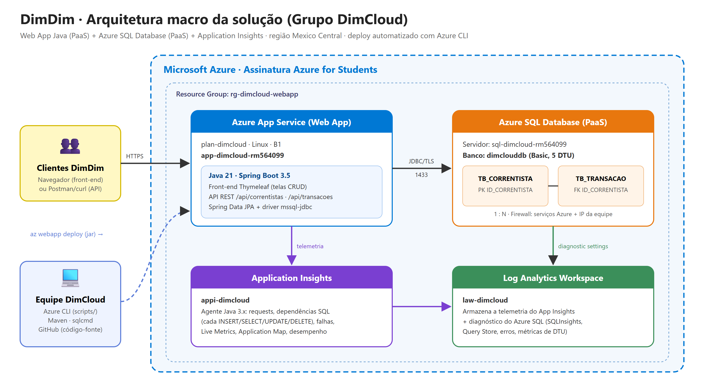

# DimDim · Web App Java + Azure SQL + Application Insights

**2º Checkpoint (2º semestre): Aplicações e Banco em Nuvem**
DevOps Tools & Cloud Computing, FIAP. Prof. João Menk

## Grupo DimCloud

| Nome | RM |
|---|---|
| Nickolas Davi | RM564105 |
| Samara Vilela | RM566133 |
| Natália Cristina | RM564099 |
| Otávio Ferreira | RM565960 |
| Rodrigo Carvalho | RM565162 |

- **Aplicação na nuvem:** https://app-dimcloud-rm564099.azurewebsites.net
- **Vídeo com as evidências:** _(link do vídeo no PDF de entrega)_

---

## 1. Descrição da solução

A DimDim quer testar, antes de ir para produção, uma aplicação web rodando 100% na nuvem da Microsoft.
A solução é o **DimDim Web**, um sistema de **correntistas** e **transações bancárias** (depósito, saque,
Pix enviado e Pix recebido):

- **Front-end web** (Thymeleaf) com telas de cadastro, edição, listagem e exclusão para as duas entidades,
  painel com totais, saldo calculado por correntista e extrato filtrado.
- **API REST JSON** com GET, POST, PUT e DELETE para as mesmas entidades (`/api/correntistas` e `/api/transacoes`).
- **Persistência** no **Azure SQL Database** (PaaS, não containerizado), com duas tabelas relacionadas 1:N:
  `TB_CORRENTISTA` (1) e `TB_TRANSACAO` (N), FK com `ON DELETE CASCADE`.
- **Hospedagem** no **Azure App Service** (Web App Linux, Java 21), publicado de forma automatizada com
  **Azure CLI + `az webapp deploy`**.
- **Monitoramento** com o **Application Insights**: o agente Java 3.x (anexado na inicialização pela
  biblioteca `applicationinsights-runtime-attach`) coleta requisições, **cada comando SQL enviado ao banco
  como dependência**, exceções e métricas. O diagnóstico do Azure SQL também é enviado ao mesmo
  Log Analytics.
- **Nenhum dado sensível no código:** usuário, senha e URL do banco e a connection string do App Insights
  ficam nas **App Settings** do Web App (variáveis de ambiente). A senha só existe na variável
  `SQL_ADMIN_PASSWORD` de quem roda os scripts.

### Tecnologias
Java 21 · Spring Boot 3.5 (Web, Thymeleaf, Data JPA, Validation, Actuator) · Microsoft JDBC Driver for SQL Server ·
Azure App Service (Linux B1) · Azure SQL Database (Basic) · Application Insights + Log Analytics · Azure CLI · Maven

## 2. Arquitetura macro



Fluxo: o cliente acessa o Web App via HTTPS. O Spring Boot grava e lê no Azure SQL via JDBC/TLS (porta 1433).
O agente do Application Insights envia a telemetria (requests e dependências SQL) para o workspace do
Log Analytics, que também recebe o diagnóstico do banco. A equipe cria tudo e faz o deploy com o Azure CLI.

## 3. Estrutura do repositório

```
├── README.md                    ← este how to
├── pom.xml
├── docs/arquitetura.png         ← desenho da arquitetura (fonte: arquitetura.html)
├── api-json/                    ← JSON das operações POST/PUT + exemplos de resposta GET/DELETE
├── scripts/
│   ├── ddl.sql                  ← DDL das tabelas
│   ├── consultas.sql            ← SELECTs para conferir a persistência
│   ├── 00-variaveis.sh          ← nomes dos recursos (Azure CLI)
│   ├── 01-criar-recursos.sh     ← cria RG, SQL, App Insights, Plan, Web App e App Settings
│   ├── 02-criar-tabelas.sh      ← roda o DDL no Azure SQL (sqlcmd)
│   ├── 03-deploy.sh             ← build Maven + az webapp deploy
│   ├── 04-testes-api.sh         ← CRUD completo pela API (curl)
│   ├── 05-remover-recursos.sh   ← apaga tudo
│   ├── 06-monitoramento.sh      ← App Insights (requests + SQL) e métricas do banco pelo CLI
│   └── consultar.sh             ← SELECT nas tabelas (prova da persistência após cada operação)
└── src/main/java/br/com/fiap/dimcloud/
    ├── model/                   ← Correntista, Transacao, TipoTransacao (JPA)
    ├── repository/              ← Spring Data JPA
    ├── controller/web/          ← telas (front-end)
    └── controller/api/          ← API REST JSON
```

## 4. Modelo de dados (DDL completo em `scripts/ddl.sql`)

| TB_CORRENTISTA | | TB_TRANSACAO | |
|---|---|---|---|
| **ID_CORRENTISTA** BIGINT IDENTITY PK | | **ID_TRANSACAO** BIGINT IDENTITY PK | |
| NOME NVARCHAR(100) | | ID_CORRENTISTA BIGINT **FK** → TB_CORRENTISTA | |
| CPF CHAR(11) UNIQUE | | TIPO VARCHAR(20) (DEPOSITO, SAQUE, PIX_ENVIADO, PIX_RECEBIDO) | |
| EMAIL NVARCHAR(120) | | VALOR DECIMAL(15,2) > 0 | |
| TELEFONE NVARCHAR(20) | | DESCRICAO NVARCHAR(150) | |
| DT_CADASTRO DATETIME2 | | DT_TRANSACAO DATETIME2 | |

---

## 5. How to: implantação completa na nuvem (passo a passo)

### 5.1 Pré-requisitos
- Conta Azure com assinatura ativa (usamos a **Azure for Students**)
- [Azure CLI](https://learn.microsoft.com/cli/azure/install-azure-cli) 2.60+
- **Java 17+** e **Maven 3.9+** (para gerar o `.jar`; o bytecode é 17 e roda no Java 21 do App Service)
- **sqlcmd** ([download](https://learn.microsoft.com/sql/tools/sqlcmd/sqlcmd-utility)), ou use o *Query editor* do portal
- Terminal **bash**: o **Azure Cloud Shell** já tem Azure CLI, Java 17, Maven e git (o `sqlcmd` é instalado sozinho pelos scripts). No Git Bash do Windows também funciona

### 5.2 Clonar e fazer login
```bash
git clone https://github.com/natcsouza/dimcloud-webapp.git
cd dimcloud-webapp
az login
az account set --subscription "<id-da-sua-assinatura>"
```

### 5.3 Definir variáveis e senha (fora do código)
Os nomes dos recursos ficam em `scripts/00-variaveis.sh`. Como SQL Server e Web App precisam de nome único no
mundo, eles levam o RM. Para usar o seu RM:
```bash
export RM=rm123456                 # seu RM
export LOCATION=canadacentral      # a Azure for Students da FIAP só libera 5 regiões (eastus2 sem capacidade p/ SQL)
export SQL_ADMIN_PASSWORD='<senha forte>'   # maiúscula, minúscula, número e símbolo
```
> A senha **não** está em nenhum arquivo do repositório. Ela vai direto para as App Settings do Web App.

### 5.4 Criar a infraestrutura (Azure CLI)
```bash
./scripts/01-criar-recursos.sh
```
O script executa, em ordem:
1. `az provider register` para Microsoft.Web, Sql, Insights e OperationalInsights
2. `az group create` → **rg-dimcloud-webapp**
3. `az sql server create` + `az sql db create` → **sql-dimcloud-&lt;RM&gt;** / **dimclouddb** (Basic)
4. `az sql server firewall-rule create` → libera serviços Azure (0.0.0.0) e o IP da máquina
5. `az monitor log-analytics workspace create` → **law-dimcloud**
6. `az monitor app-insights component create` → **appi-dimcloud**
7. `az monitor diagnostic-settings create` → logs e métricas do banco no Log Analytics
8. `az appservice plan create` (Linux B1) + `az webapp create --runtime JAVA:21-java21` → **app-dimcloud-&lt;RM&gt;**
9. `az webapp config appsettings set` → `SPRING_DATASOURCE_URL/USERNAME/PASSWORD`,
   `APPLICATIONINSIGHTS_CONNECTION_STRING`, `APPLICATIONINSIGHTS_ROLE_NAME`
10. Always On e HTTPS only

### 5.5 Criar as tabelas no Azure SQL
```bash
./scripts/02-criar-tabelas.sh
```
Roda o `scripts/ddl.sql` com `sqlcmd` e lista as tabelas criadas.
*Alternativa:* Portal → SQL databases → **dimclouddb** → **Query editor** → login SQL → cole o `ddl.sql` → **Run**.

### 5.6 Deploy automatizado (Azure CLI + az webapp deploy)
```bash
./scripts/03-deploy.sh
```
Gera `target/dimcloud.jar` com `mvn package` e publica com:
```bash
az webapp deploy --resource-group rg-dimcloud-webapp --name app-dimcloud-<RM> \
  --src-path target/dimcloud.jar --type jar --restart true
```
Aguarde de 1 a 2 minutos e abra `https://app-dimcloud-<RM>.azurewebsites.net`.

### 5.7 Testar o CRUD com persistência
**Pelo front-end:**
1. **Correntistas → + Novo correntista** → Salvar (INSERT em `TB_CORRENTISTA`)
2. **Editar** → Salvar (UPDATE) · **Excluir** (DELETE, com as transações em cascata)
3. **Transações → + Nova transação** → escolha o correntista, o tipo e o valor (INSERT em `TB_TRANSACAO`)
4. **Editar** (UPDATE) · **Excluir** (DELETE)

Depois de **cada** operação, confira no banco com `./scripts/consultar.sh correntistas | transacoes | saldo | tudo` (ou cole `scripts/consultas.sql` no Query editor):
```sql
SELECT * FROM dbo.TB_CORRENTISTA;
SELECT * FROM dbo.TB_TRANSACAO;
```

**Pela API (JSON):**
```bash
./scripts/04-testes-api.sh      # POST, GET, PUT e DELETE nas duas tabelas
```

### 5.8 Monitoramento com o Application Insights
Pelo CLI: `./scripts/06-monitoramento.sh` lista as requisições, os comandos SQL (dependências) e as métricas do banco.

Portal → **appi-dimcloud**:
- **Live Metrics:** requisições em tempo real enquanto usa o app
- **Application Map:** `dimcloud-webapp` → dependência **SQL dimclouddb**
- **Performance → Dependencies:** cada comando SQL (INSERT/UPDATE/DELETE/SELECT) com duração
- **Failures:** exceções e respostas 4xx/5xx
- **Logs** (KQL), por exemplo:
```kusto
// transações no banco feitas pela aplicação
dependencies
| where type == "SQL"
| project timestamp, target, data, duration, success
| order by timestamp desc

// requisições por rota
requests
| summarize qtd = count(), media_ms = avg(duration) by name
| order by qtd desc
```
Monitoramento do banco: Portal → **dimclouddb** → *Monitoring → Metrics* (DTU, conexões, deadlocks) e
*Query Performance Insight*. Os logs do diagnóstico ficam em **law-dimcloud** (tabela `AzureDiagnostics`).

### 5.9 Remover os recursos
```bash
./scripts/05-remover-recursos.sh
```

---

## 6. API REST: operações e JSON

Base: `https://app-dimcloud-rm564099.azurewebsites.net`

| Método | Rota | Corpo | Retorno |
|---|---|---|---|
| GET | `/api/correntistas` | | lista com saldo |
| GET | `/api/correntistas/{id}` | | correntista |
| GET | `/api/correntistas/{id}/transacoes` | | extrato |
| POST | `/api/correntistas` | `api-json/correntista-post.json` | 201 + correntista |
| PUT | `/api/correntistas/{id}` | `api-json/correntista-put.json` | 200 + correntista |
| DELETE | `/api/correntistas/{id}` | | 204 |
| GET | `/api/transacoes` | | lista |
| GET | `/api/transacoes/{id}` | | transação |
| POST | `/api/transacoes` | `api-json/transacao-post.json` | 201 + transação |
| PUT | `/api/transacoes/{id}` | `api-json/transacao-put.json` | 200 + transação |
| DELETE | `/api/transacoes/{id}` | | 204 |

**POST /api/correntistas**
```json
{ "nome": "Steve Jobs", "cpf": "12345678901", "email": "steve.jobs@dimdim.com.br", "telefone": "(11) 99999-0001" }
```
**PUT /api/correntistas/1**
```json
{ "nome": "Steve Paul Jobs", "cpf": "12345678901", "email": "steve@dimdim.com.br", "telefone": "(11) 98888-0002" }
```
**POST /api/transacoes**
```json
{ "correntistaId": 1, "tipo": "DEPOSITO", "valor": 1500.00, "descricao": "Depósito inicial", "dataTransacao": "2026-10-05T10:30:00" }
```
**PUT /api/transacoes/1**
```json
{ "correntistaId": 1, "tipo": "PIX_RECEBIDO", "valor": 2500.50, "descricao": "Pix recebido - salário", "dataTransacao": "2026-10-05T11:00:00" }
```
**GET /api/transacoes** (resposta)
```json
[ { "id": 1, "tipo": "DEPOSITO", "valor": 1500.00, "descricao": "Depósito inicial",
    "dataTransacao": "2026-10-05T10:30:00", "correntistaId": 1, "correntistaNome": "Steve Jobs" } ]
```
**DELETE** `/api/transacoes/1` e `/api/correntistas/1` → `204 No Content`

Exemplos de curl:
```bash
BASE=https://app-dimcloud-rm564099.azurewebsites.net
curl -X POST $BASE/api/correntistas -H "Content-Type: application/json" -d @api-json/correntista-post.json
curl $BASE/api/correntistas
curl -X PUT $BASE/api/correntistas/1 -H "Content-Type: application/json" -d @api-json/correntista-put.json
curl -X DELETE $BASE/api/correntistas/1
```
